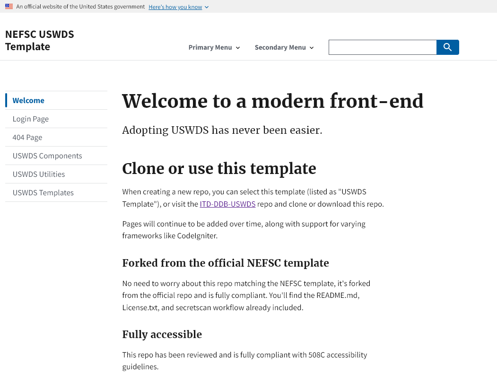

This repository is a scientific product and is not official communication of the National Oceanic and Atmospheric Administration, or the United States Department of Commerce. All NOAA GitHub project code is provided on an ‘as is’ basis and the user assumes responsibility for its use. Any claims against the Department of Commerce or Department of Commerce bureaus stemming from the use of this GitHub project will be governed by all applicable Federal law. Any reference to specific commercial products, processes, or services by service mark, trademark, manufacturer, or otherwise, does not constitute or imply their endorsement, recommendation or favoring by the Department of Commerce. The Department of Commerce seal and logo, or the seal and logo of a DOC bureau, shall not be used in any manner to imply endorsement of any commercial product or activity by DOC or the United States Government.

## About
This repository contains a simple front-end for NEFSC websites using the US Web Design System. 

Download and run index.html for a demo.

## Instructions
1. Create a new repository with this repo as a template, or you can clone or download.

2. Adapt pages to fit your site.
3. Visit [USWDS](https://designsystem.digital.gov/components/overview/) for more components and examples.

## More info
- Fully accessible and 508C compliant.
- Fully mobile-responsive.
- Includes NOAA favicon.
- Includes NEFSC footer with 150th Anniversary logo and relevant links.
- Includes required CTM script in login page.
- Contains **custom.css** to fix a few accessibility issues.
- USWDS stylesheets are provided for reference, do not modify USWDS stylesheets or JS if possible to prevent issues with updating USWDS (which happens regularly).

